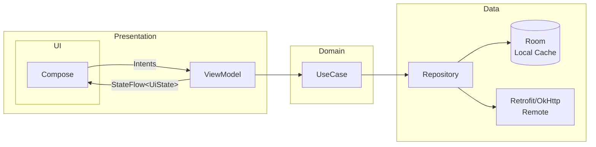

# Desafio Android — Solução (Jetpack Compose)

> **Resumo :** Arquitetura modular, UDF com ViewModel + StateFlow, offline-first (Room), testes (unit + instrumentado + UI Compose) e resiliência a rotação, process-death e rede ruim.


---

## Índice
1. [Stack](#stack)
2. [Screenshots / GIFs](#screenshots--gifs)
3. [Arquitetura](#arquitetura)
4. [Módulos](#módulos)
5. [Fluxo de Dados](#fluxo-de-dados)
6. [Política de Cache](#política-de-cache)
7. [Glosário de Branchs](#glossário-de-branches)
8. [Testes](#testes)
9. [Próximos Passos](#próximos-passos)

---

## Stack
| Camada | Libs |
| ------ | ---- |
| UI | **Jetpack Compose**, Navigation Compose, Coil |
| DI | Koin |
| Assíncrono | Coroutines + Flow |
| Network | Retrofit  |
| Cache | Room |
| Qualidade | Detekt, Ktlint |
| Testes | JUnit5, MockK, Turbine, MockWebServer, Compose UI Testing |

---

## Screenshots / GIFs


---

## Arquitetura


> **Por quê assim ?**  
> Resiliência: ViewModel + SavedStateHandle seguram estado em rotação/process-death.
> Evolução: Domain separado garante mudanças de regra sem mexer UI/Data.
> Offline-first: Repo decide cache versus remoto, mantendo UX consistente.

---

## Módulos

```
app/                          # Chamada do di+ navegação
core/designsystem/            # Tema, cores, componentes, espaçamentos
core/navigation               # Composition root + navegação
feature/home/                 # Tela principal (UI + VM + DI)
```

---

## Fluxo de Dados

Estado imutável (`StateFlow<UiState>`) na ViewModel; eventos one-shot em `SharedFlow`.

```kotlin
sealed class HomeUiState {
    object Loading : HomeUiState()
    data class Success(val users: List<UserDomain>) : HomeUiState()
    data class Error(val message: String) : HomeUiState()
}
```

---

## Política de Cache

1. **Room primeiro** (`loadFromDb()`).
2. Se dados estão velhos, faz **refresh** em paralelo (Remote → Room → UI).
3. Offline? Mostra o que tem no DB e sinaliza modo offline.

---
<details>
<summary>📚 Glossário de Branches</summary>

> **Por quê?**  
> Este glossário serve como _guarda-chuva_ de tarefas: cada branch tem nome padronizado (`<área>/<nº>-<slug-descritivo>`), facilitando a discussão nos PRs, a ordem de merge e a leitura do meu raciocínio de construção.

## 📂 Infra

| Nº  | Branch | Descrição rápida |
|----:|--------|------------------|
| 001 | `infra/001-project-setup` | Criação do projeto Android, Gradle raiz, README, `.gitignore`. |
| 002 | `infra/002-github-actions` | Workflow CI: `assembleDebug`, |
| 003 | `infra/003-pr-templates` | Templates de Pull Request e Issue na pasta `.github/`. |

---

## 🧱 Core

| Nº  | Branch | Descrição rápida |
|----:|--------|------------------|
| 001 | `core/001-designsystem-foundation` | **core/designsystem** – modulo. |
| 001 | `core/001-designsystem-foundation_pt2` | **core/designsystem** – cores, tipografia, espaçamentos, `Theme.kt`, previews. |
| 002 | `core/002-designsystem-components` | Botões, textos, cards, estados de loading/erro, docs KDoc + stories no Playground. |
| 003 | `core/003-navigation` | **core/navigation** – Prepara para a navegação do app |

---

## ✨ Feature: Home

| Nº  | Branch | Descrição rápida |
|----:|--------|------------------|
| 001 | `feature/001-model-dto-mapper` | Criação dos modelos de domínio, DTOs da API e mapeadores entre eles. |
| 004 | `feature/004-usecase` | Camada opcional de UseCase isolando regras de negócio da UI. |
| 005 | `feature/005-home-viewmodel` | ViewModel e contratos de UI (State + Event), gerenciamento com StateFlow. |
| 006 | `feature/006-adjusting-internal` | Ajusta as classes internal do modulo home pra nao dar acesso a outros modulos . |


---

### 🗝️ Padrão de nomenclatura
<área>/<número-sequencial>-<slug-kebab-case>

* **área** = `infra`, `core`, `feature`, `app`, `docs`  
* **número** = ordem de merge (três dígitos para manter ordenação lexicográfica)  
* **slug** = resumo claro da tarefa/objetivo  

Esse esquema garante histórico linear, PRs focados e fácil rastreabilidade de discussões.

</details>

## Testes

| Tipo | Ferramentas | Cobertura |
| ---- | ----------- | --------- |
| Unit | JUnit, MockK, Turbine | ViewModel, Repo, UseCase |
| Instrumentado | Room (in-memory), MockWebServer | DAO, rede 200/304/404/500 |
| UI Compose | Compose Test | loading/empty/error/success + ações |


---

## Próximos Passos

- Snapshot tests (Papparazzi)   
- Feature flags simples  
- E2E tests
---
