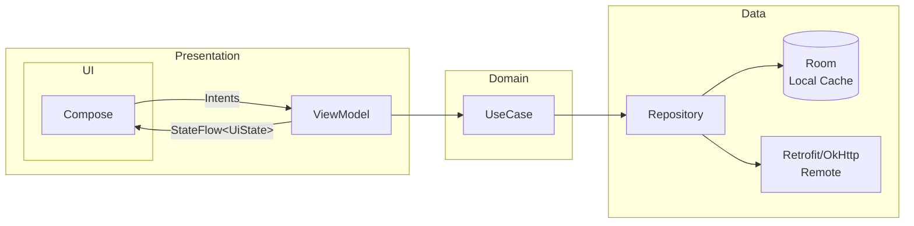

# Desafio Android — Solução (Jetpack Compose)

> **Resumo :** Arquitetura modular, UDF com ViewModel + StateFlow, offline-first (Room + OkHttp cache), testes (unit + instrumentado + UI Compose) e resiliência a rotação, process-death e rede ruim.


---

## Índice
1. [Stack](#stack)
2. [Screenshots / GIFs](#screenshots--gifs)
3. [Arquitetura](#arquitetura)
4. [Módulos](#módulos)
5. [Fluxo de Dados](#fluxo-de-dados)
6. [Política de Cache](#política-de-cache)
7. [Tratamento de Erros](#tratamento-de-erros)
8. [Glosário de Branchs](#glossário-de-branches)
9. [Como Rodar](#como-rodar)
10. [Testes](#testes)
11. [Próximos Passos](#próximos-passos)

---

## Stack
| Camada | Libs |
| ------ | ---- |
| UI | **Jetpack Compose**, Navigation Compose, Coil |
| DI | Koin |
| Assíncrono | Coroutines + Flow |
| Network | Retrofit + OkHttp (logging só em *debug*) |
| Cache | Room + OkHttp cache (ETag/Last-Modified) |
| Paginação | Paging 3 |
| Qualidade | Detekt, Ktlint |
| Testes | JUnit5, MockK, Turbine, MockWebServer, Compose UI Testing |

---

## Screenshots / GIFs

> **TODO:** inserir 2–3 GIFs curtos (loading → sucesso; erro → retry; offline).

---

## Arquitetura


> **Por quê assim ?**  
> Resiliência: ViewModel + SavedStateHandle seguram estado em rotação/process-death.
> Evolução: Domain separado garante mudanças de regra sem mexer UI/Data.
> Offline-first: Repo decide cache versus remoto, mantendo UX consistente.

---

## Módulos

```
app/                          # Chamada do di+ navegação
core/designsystem/            # Tema, cores, componentes, espaçamentos
core/navigation               # Composition root + navegação
core/network/                 # Retrofit/OkHttp + interceptors
core/common/                  # Result, Error, DispatchersProvider
feature/home/                 # Tela principal (UI + VM + DI)
```

---

## Fluxo de Dados

Estado imutável (`StateFlow<UiState>`) na ViewModel; eventos one-shot em `SharedFlow`.

```kotlin
data class UiState(
    val isLoading: Boolean = false,
    val items: List<UiItem> = emptyList(),
    val error: UiError? = null,
    val isEmpty: Boolean = false
)
```

```kotlin
@Composable
fun Screen(state: UiState, onRetry: () -> Unit) {
    when {
        state.isLoading -> Loading()
        state.error != null -> Error(onRetry)
        state.isEmpty -> Empty(onRetry)
        else -> Content(state.items)
    }
}
```

---

## Política de Cache

1. **Room primeiro** (`loadFromDb()`).
2. Se dados estão velhos, faz **refresh** em paralelo (Remote → Room → UI).
3. Offline? Mostra o que tem no DB e sinaliza modo offline.

---

## Tratamento de Erros

| Throwable -> AppError | Como a UI reage |
| --------------------- | --------------- |
| `UnknownHostException` | Sem conexão |
| `SocketTimeoutException` | Timeout |
| `HttpException` 4xx/5xx | `Server(code)` |
| Outro | `Unknown` |

Retry com backoff nos casos que vale a pena e mensagens “Tentar novamente”.

---
## Glossário de Branches

> **Por quê?**  
> Este glossário serve como _guarda-chuva_ de tarefas: cada branch tem nome padronizado (`<área>/<nº>-<slug-descritivo>`), facilitando a discussão nos PRs, a ordem de merge e a leitura do meu raciocínio de construção.

## 📂 Infra

| Nº  | Branch | Descrição rápida |
|----:|--------|------------------|
| 001 | `infra/001-project-setup` | Criação do projeto Android, Gradle raiz, README, `.gitignore`. |
| 002 | `infra/002-github-actions` | Workflow CI: `assembleDebug`, |
| 003 | `infra/003-pr-templates` | Templates de Pull Request e Issue na pasta `.github/`. |

---

## 🧱 Core

| Nº  | Branch | Descrição rápida |
|----:|--------|------------------|
| 001 | `core/001-designsystem-foundation` | **core/designsystem** – modulo. |
| 001 | `core/001-designsystem-foundation_pt2` | **core/designsystem** – cores, tipografia, espaçamentos, `Theme.kt`, previews. |
| 002 | `core/002-designsystem-components` | Botões, textos, cards, estados de loading/erro, docs KDoc + stories no Playground. |
| 003 | `core/003-navigation` | **core/navigation** – Prepara para a navegação do app |

---

## ✨ Feature: Home

| Nº  | Branch | Descrição rápida |
|----:|--------|------------------|
| 001 | `feature/001-model-dto-mapper` | Criação dos modelos de domínio, DTOs da API e mapeadores entre eles. |
| 002 | `feature/002-repository-impl` | Implementação do repositório com Retrofit + Room no próprio módulo. |
| 003 | `feature/003-room-cache` | Entidades Room, DAO e política de cache local-first integrada ao repo. |
| 004 | `feature/004-usecase` | Camada opcional de UseCase isolando regras de negócio da UI. |
| 005 | `feature/005-home-viewmodel` | ViewModel e contratos de UI (State + Event), gerenciamento com StateFlow. |
| 006 | `feature/006-home-screen` | Tela principal em Compose, integração com ViewModel e preview. |
| 007 | `feature/007-error-handling` | Mapeamento de erros para estado de tela, mensagens amigáveis, retry. |
| 008 | `feature/008-ui-tests` | Testes instrumentados e de UI Compose cobrindo cenários principais. |
| 009 | `feature/009-performance-a11y` | Ajustes finais de recomposição, semantics, acessibilidade e lazy loading. |

---

## 📱 App

| Nº  | Branch | Descrição rápida |
|----:|--------|------------------|
| 016 | `app/016-navigation-root` | Navigation Compose, injeta VM Home, restaura estado em rotação. |

---

## 📝 Docs

| Nº  | Branch | Descrição rápida |
|----:|--------|------------------|
| 021 | `docs/021-readme-gifs` | GIFs, badges finais, cobertura, LICENSE, contatos no README. |

---

### 🗝️ Padrão de nomenclatura
<área>/<número-sequencial>-<slug-kebab-case>

* **área** = `infra`, `core`, `feature`, `app`, `docs`  
* **número** = ordem de merge (três dígitos para manter ordenação lexicográfica)  
* **slug** = resumo claro da tarefa/objetivo  

Esse esquema garante histórico linear, PRs focados e fácil rastreabilidade de discussões.

---
## Como Rodar

> Depende de **JDK 17** e Android Studio **Koala** ou superior.

```bash
git clone https://github.com/SEU-USUARIO/SEU-REPO.git
cd SEU-REPO

./gradlew clean assembleDebug detekt ktlintCheck   # build + análise
./gradlew test                                     # unit tests
./gradlew connectedAndroidTest                     # instrumentados
```

Secrets/API → `local.properties` (fica fora do Git):

```
API_BASE_URL=https://api.exemplo.com/
```

---

## Testes

| Tipo | Ferramentas | Cobertura |
| ---- | ----------- | --------- |
| Unit | JUnit, MockK, Turbine | ViewModel, Repo, UseCase |
| Instrumentado | Room (in-memory), MockWebServer | DAO, rede 200/304/404/500 |
| UI Compose | Compose Test | loading/empty/error/success + ações |

Meta de ≥ 70 % em domain/data.

---

## Próximos Passos

- Snapshot tests (Papparazzi)   
- Feature flags simples  
- E2E tests

---
